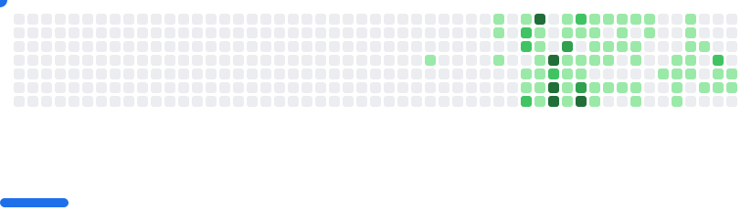

  

---

---

<h2>🎯 My Future Goals:</h2>

---

<h2>🎨 What I've Built So Far:</h2>

  

---

  
  

---

<h2>Tools & Skills:
</h2>

---

<h1 align="center">My Profiles:</h1>

<h2>CodeChef Badges</h2>

<h2>My Other Badges:</h2>

  

World's Largest Hackathon Writing Challenge Completion

##

</a>

##

---

  

<h2 align="center">Top Repos:</h2>

 

##

<picture>
  <source
    media="(prefers-color-scheme: dark)"
    srcset="images/breakout-dark.svg"
  />
  <source
    media="(prefers-color-scheme: light)"
    srcset="images/breakout-light.svg"
  />
  
</picture>

##

<picture>
  <source media="(prefers-color-scheme: dark)" srcset="https://raw.githubusercontent.com/Tech-Psycho95/Tech-Psycho95/output/github-snake-dark.svg" />
  <source media="(prefers-color-scheme: light)" srcset="https://raw.githubusercontent.com/Tech-Psycho95/Tech-Psycho95/output/github-snake.svg" />
  
</picture>

---

<h2 align="center">Trophy Rack:</h2>

##

###

---

  

---

  </a>

---

---

